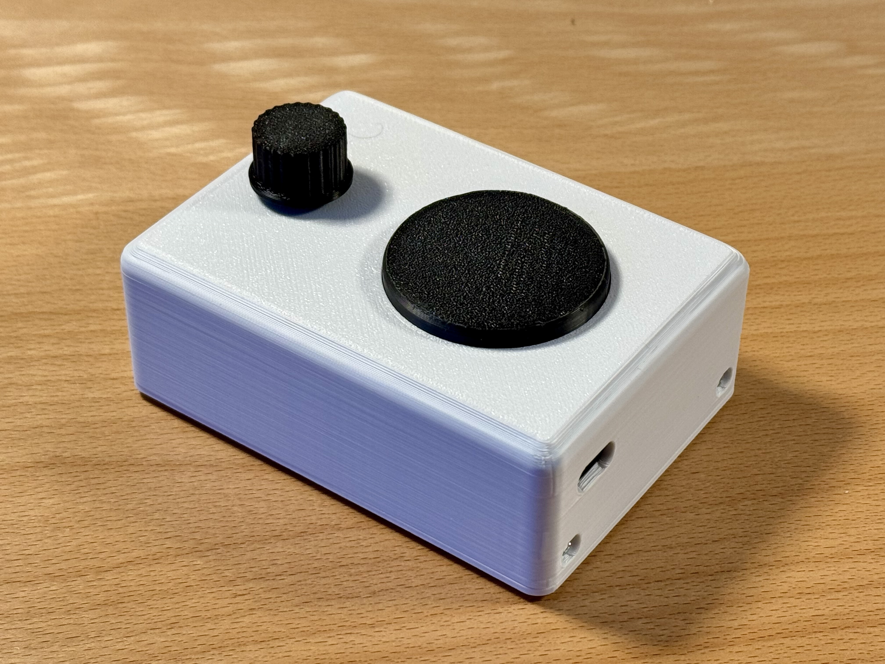

# Speaking Clock – Open Source Talking Clock for Visually Impaired Users

This repository is part of an open-source project for a simple, battery-powered **talking clock** designed for visually impaired and elderly users.

The device announces the current time at the press of a button.  
If the button is pressed a second time within a short time window, it also announces the date.

Watch the full project video on YouTube:  
[Talking Clock – Demo & Build](https://youtu.be/vuX4cK3g9_s?si=J2-5so-r-MG_IsnX)

## Part of an Accessible Devices Collection

This repository is part of a small collection of **minimalistic, accessibility-focused devices for visually impaired users**. All projects follow a similar philosophy: simple operation, tactile or acoustic feedback, and a strong focus on usability and low power consumption.

The currently available devices in this collection are:

- **[DAB+ Radio](https://github.com/lhm0/DAB_minimalist)** – A minimalist, easy-to-use DAB+ radio  
- **[Talking Clock](https://github.com/lhm0/talking_clock)** – This project: a clock that announces the time acoustically  
- **[Accessible IR Remote Control](https://github.com/lhm0/accessible_ir_remote)** – A tactile, low-power TV remote control  

All projects are designed to be practical, easy to reproduce, and suitable for everyday use by visually impaired users.

## Design Goals

The main design goals of this project are:

- A **minimal and accessible user interface**
- **Fully offline operation** (no internet required)
- **Very low power consumption** for multi-year battery life
- **Simple configuration** using a smartphone via Wi-Fi
- **Low-cost hardware** based on breakout modules and a custom PCB
- A **3D-printed enclosure** for easy assembly

The clock is based on an ESP32-S3 microcontroller, uses a DS3231 real-time clock for accurate timekeeping, and plays pre-generated MP3 audio files through an I2S audio amplifier and a small speaker.  
To achieve extremely low standby power consumption, the entire system is powered only when an announcement is made.

All hardware design files, firmware, and related resources are open source and can be adapted or extended for your own projects.

---

## Time Announcement Audio Files

This repository contains **English time announcement audio files (MP3)** generated for use in the speaking clock and similar applications, systems, or projects.

These files are used as building blocks to construct spoken time and date announcements, for example:

- “The time is noon”
- “It’s one p.m.”
- “Today is Monday”

---

## License / Usage

The audio files in this repository were generated using **ttsMP3.com**.  
According to the ttsMP3 FAQ, these MP3 files may be used in personal and commercial projects without restriction (see: https://ttsmp3.com/faq).

The audio files can therefore be:

- Used in personal projects  
- Used in commercial projects  
- Shared and redistributed as part of other projects  

**Note:** This repository does not include or distribute any TTS software or voices themselves, only the generated audio files.

---

## About

These audio files are intended to be used as building blocks for English time announcements in embedded projects such as the Speaking Clock.

If you use this repository, please make sure to check the current terms of ttsMP3.com to ensure compliance with their conditions.